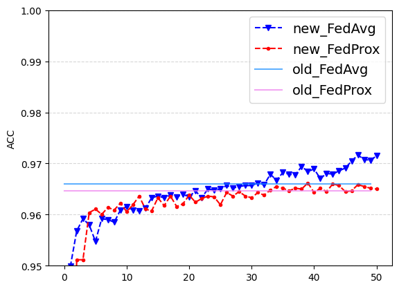
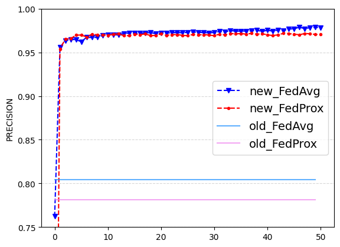
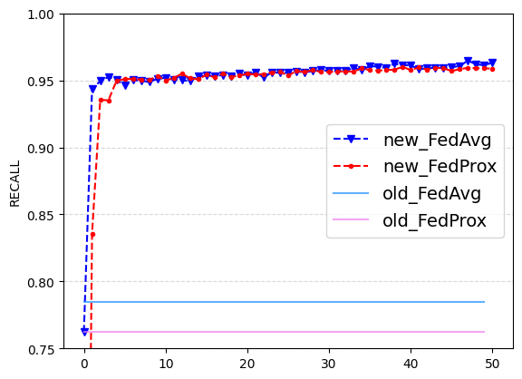

## Voice Fishing Detection on Federated Learning condition.
___

### Abstract
현대 사회에서 큰 문제중 하나인 보이스 피싱은 다양한 기술을 사용하여 많은 사람에게 피해를 주
고 있다. 이러한 문제를 해결하고자 많은 시도가 있었고 그 중 한 방법이 인공지능을 활용하여 보이
스 피싱을 탐지하는 방법이다. 하지만 인공지능을 활용하는 과정에서 데이터 프라이버시 보장이 이
루어지지 않는 문제가 발생한다. 본 논문에서는 이러한 문제를 해결하고자 연합학습을 사용한 개인
정보 보호에 특화된 보이스 피싱 탐지 기술을 제안한다. 연합학습은 사용자의 데이터를 중앙 서버로
전송하지 않고 로컬 디바이스에서 학습한 모델만을 서버로 전송하여 개인정보 유출을 방지하는 인공
지능 학습 방법이다. 또한 스노클을 활용한 오토 데이터 라벨링 기법을 적용하여 피싱 여부를 자동
으로 분류하고 탐지 성능을 향상시킨다. 본 기술은 일반적인 인공지능 학습 기술과 비교하여 좋은
성능을 보이며 특히 피싱 탐지에서 중요한 부분인 긍정 클래스 예측 부분에서 높은 성능을 보이고
있다.

### Performance Table
|          |      Acc |   Precision |   F1score |   Recall |       MAR    |
|:---------|---------:|------------:|----------:|---------:|-------------:|
|__FedAvg__|__97.16%__|  __97.88%__ |__97.04%__ |__96.48%__|__0.0351776__ |
| FedProx  | 96.61%   |    97.18%   |  96.52%   | 96.00%   |   0.039959   |

### Result Graph
 